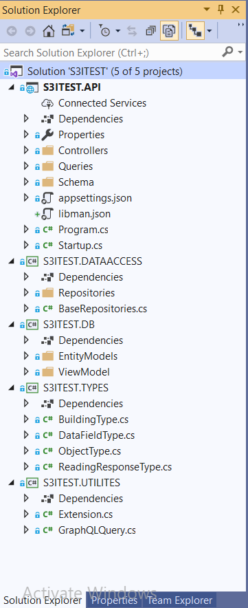
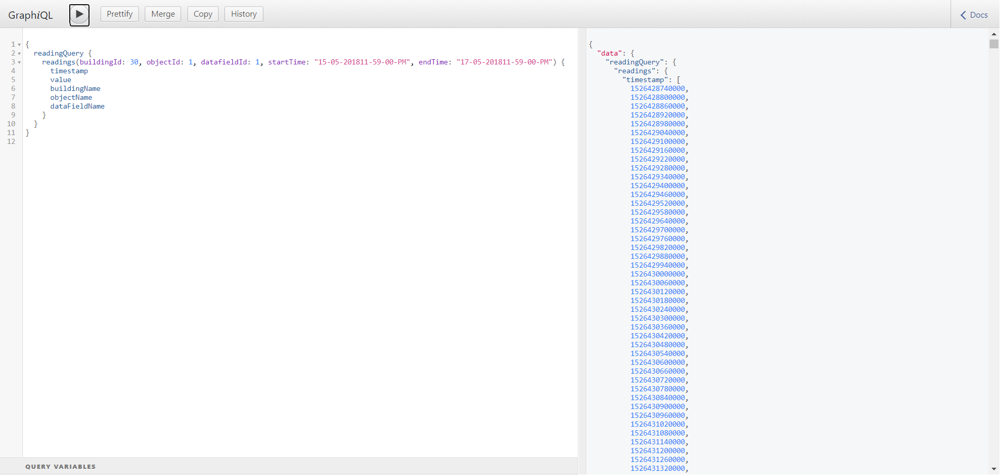

# An Analysis on Big Data Pulling Performance [Backend]

## Tools

#### DB
* PostgreSQL
* TimescaleDB

#### Backend 
* ASP.NET Core 3.1
* GraphQL 2.4.0
* Dapper
* Npgsql

## Frontend Git Repository

https://gitlab.com/iamonlysaiful/s3-bigdata-performance-test-frontend

In given link I provided my front-end project including specific details with README.md

## Prerequisites

* .NET Core 3.1 sdk
* .NET Core 3.1 runtime
* PostgreSQL (Version: >=11)
* TimescaleDB 

## Project Initialization & Dependency Installation

* After opening cloned project, build project.
* Change DB Connection string 
* Run DBScript from **DBScript** at **S3ITEST.API**
* Change Reading Table Name on appsettings.json (if neeeded) 

N.B In my case reading table name is **ReadingV2**

## DB Disccussion
As Database in this project I used Postgresql.

> **Why I used PostgreSQL over MSSQL?** Answer is simple to me. First, PostgreSQL: The World’s Most Advanced Open Source Relational Database &
Second, We also have access to lots of extensions e.g. **TimescaleDB** that will enable new ways to process data right from the database.

As my database contain timeseries data I used **TimesclaeDB** as extension, and used **Hyper Table** and **Data Compression** features for my project within given criteria.

> Time series data from IoT tends to be voluminous and hence the demands on the database to store that data efficiently for both ingest and query is high. 
TimescaleDB is an open-source, scalable SQL engine that meets these demands quite effectively.

## Project Discussion

As Backend technology I used ASP.NET Core 3.1 - GraphQL API

> **Why I used GraphQL?**   
Some Of reasons are:
> * **Strongly-typed Schema.**  
> All the types (such as Boolean, String, Int, Float, ID, Scalar) supported by the API are specified in the schema in GraphQL Schema Definition Language (SDL), 
which helps determine the data that is available and the form it exists in. This, consequently, makes GraphQL less error-prone.
> * **No Over-Fetching or Under-Fetching.**  
> With GraphQL, developers can fetch only what is required. Nothing less, nothing more. This solves the issues that arise due to over-fetching and under-fetching.
> * **Saves Time and Bandwidth.**  
> GraphQL allows making multiple resources request in a single query call, which saves a lot of time and bandwidth by reducing the number of network round trips to the server.
> * **Schema Stitching for Combining Schemas.**  
> Schema stitching allows combining multiple, different schemas into a single schema. In a microservices architecture, where each microservice handles the business 
logic and data for a specific domain, this is very useful. Each microservice can define its own GraphQL schema, after which you’d use schema stitching to weave them 
into one that is accessed by the client.
> * **Versioning Is Not Required.**  
> In REST architecture, developers create new versions (e.g., api.domain.com/v1/, api.domain.com/v2/) due to changes in resources or the request/response structure of 
the resources over time. Hence, maintaining versions is a common practice. With GraphQL, there is no need to maintain versions. The resource URL or address remains the same. 
You can add new fields and deprecate older fields. This approach is intuitive as the client receives a deprecation warning when querying a deprecated field.
> * **Transform Fields and Resolve With Required Shape.**  
> A user can define an alias for fields, and each of the fields can be resolved into different values.

Refference read: https://dzone.com/articles/why-and-when-to-use-graphql-1

#### Project Structure Details

In brief, In this project I tried to maintain and focus on  coding standard specially of **GraphQL .NET** and **.NET Core 3.1**

Here is my Project Structure:

  * S3ITEST.API
    * Controllers
    * Queries
    * Schema
  * S3ITEST.DATAACCESS
    * Repositories
  * S3ITEST.DB
    * EntityModels
    * ViewModels
  * S3ITEST.TYPES
  * S3ITEST.UTILITIES

#### S3ITEST.API
Here I demonstrated graphql Queries, Schemas & API. Also integrated **GraphiQL UI** which Provides a 
tabbed interface for editing and testing GraphQL.

#### S3ITEST.DATAACCESS
It holds all repositories. Here I used **Dapper** as ORM Tool and **Npgsql** as connection wrapper with postgres

#### S3ITEST.DB
It holds all DB Entities with Viewmodels.

#### S3ITEST.TYPES
As GraphQL is a strongly typed language. Here I include all my responses mapping with GraphQL Types.

#### S3ITEST.UTILITIES
Some function I may need all over project, I included them here. 

## Screenshots

GraphiQL UI.

## Feedback

Any feedback would be gratefully recieved!

Thanks, iamonlysaiful@outlook.com